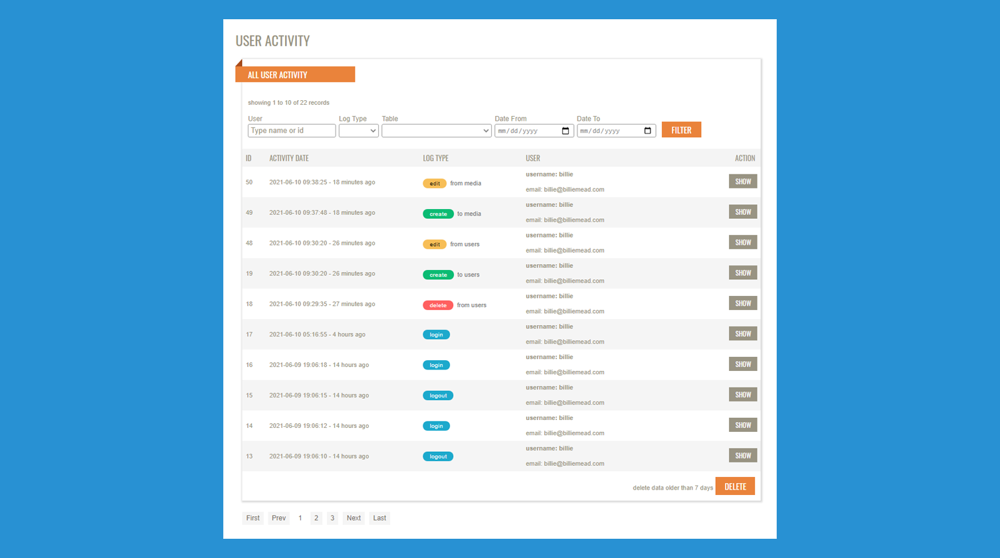

<h1 align="center">Laravel Activity Logging</h1>

Monitor your user activity with beautiful responsive & easy user-interface!

### Installation

STEP 1: Run this command given below to install the laravel user activity package:

<code>composer require billiemead/laravel-activity-log</code>

STEP 2: Now run this artisan command:

<code>php artisan activity-log:install</code>

Installation finished!

### Change Log

v1.0.5
- Added Stats Controller
- Added logoff event logging

v1.0.4
- Completely enable or disable logging by `activated` config value
- Added Base model logging compatibility

v1.0.3
- Minor improvements

v1.0.2
- Create log type added
- User model configuration
- UI ajax loading indicator